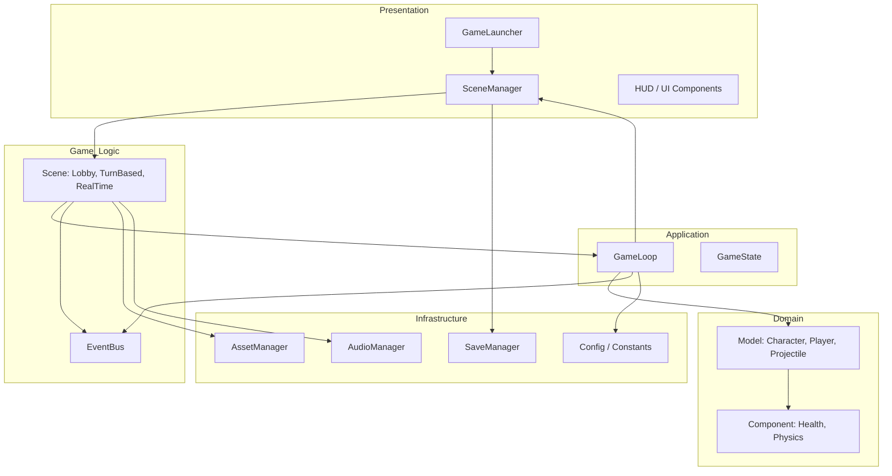
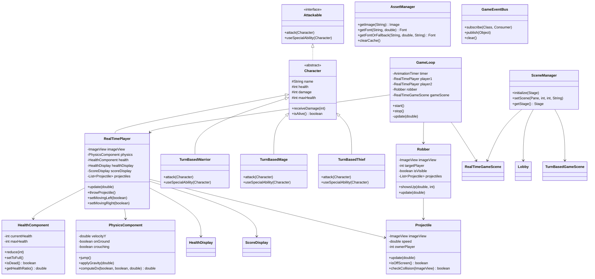

# ⚔️ GamePoo

> **Two Modes. One Keyboard. Infinite Chaos.**

A local multiplayer JavaFX game where friends become foes in two distinct battle modes.
Choose your champion, master your abilities, and claim victory — either turn by turn or in real-time mayhem.

---

## 📋 Table of Contents

- [About](#about)
- [Features](#features)
- [Screenshots](#screenshots)
- [Gameplay](#gameplay)
- [Characters](#characters)
- [Controls](#controls)
- [Technologies](#technologies)
- [Architecture](#architecture)
- [Design Patterns](#design-patterns)
- [Class Diagram](#class-diagram)
- [Folder Structure](#folder-structure)
- [Game Systems](#game-systems)
- [User Interface](#user-interface)
- [Installation](#installation)
- [Building](#building)
- [Distribution](#distribution)
- [Testing](#testing)
- [Performance](#performance)
- [Save System](#save-system)
- [Roadmap](#roadmap)
- [Upcoming Features](#upcoming-features)
- [Documentation](#documentation)
- [Contributing](#contributing)
- [FAQ](#faq)
- [License](#license)
- [Credits](#credits)
- [Acknowledgements](#acknowledgements)
- [Changelog](#changelog)
- [Contributors](#contributors)

---

## About

GamePoo is a **local multiplayer brawler** built entirely with **Java 21** and **JavaFX**. It offers two radically different combat experiences:

- **Turn-Based Mode** — Tactical 1-vs-2 encounters where every decision matters. Choose your hero, face two AI enemies, and outsmart them with strategic attacks and special abilities.
- **Real-Time Mode** — Adrenaline-fueled 2-player local PvP on a single keyboard. Jump, crouch, dodge, and fire projectiles in fast-paced rounds. A mysterious **Robber** NPC may crash the party to tip the scales.

| Attribute | Detail |
|-----------|--------|
| **Genre** | Local Multiplayer, Turn-Based Tactics, Action Brawler |
| **Target Audience** | Casual gamers, Java learners, game dev students |
| **Objective** | Defeat all opponents to win the match |
| **Player Count** | 1 (vs AI) or 2 (local PvP) |
| **Gameplay Philosophy** | Easy to pick up, rewarding to master. Minimalist mechanics with emergent depth. |

---

## Project Goals

This project was designed with multiple objectives in mind:

| Goal | Description |
|------|-------------|
| 🎓 **Learn OOP** | Demonstrate inheritance, polymorphism, encapsulation, and composition |
| 🖥️ **Master JavaFX** | Build a complete GUI application using JavaFX's scene graph, animation, and input APIs |
| 🏗️ **Game Architecture** | Implement a fixed-timestep game loop, component-based entities, and scene management |
| 🧩 **Design Patterns** | Apply Strategy, Observer, State, Factory, Component, and Event Bus patterns |
| 🧼 **Clean Code** | Follow SOLID principles, DRY, KISS, and Clean Architecture |
| 📦 **Build Automation** | Maven-based project with automated dependency resolution |
| ✅ **Testing** | JUnit 5 unit tests for game logic, components, and collision |

---

## Features

| Category | Features |
|----------|----------|
| **🎮 Game Modes** | Turn-Based (1v2 AI), Real-Time (2-player local PvP) |
| **👥 Characters** | 3 unique heroes per mode with distinct stats and special abilities |
| **🧠 AI** | Enemy AI for turn-based mode with strategic targeting |
| **💥 Combat** | Melee attacks, projectile fireballs, special abilities, critical hits |
| **🏃 Movement** | Full platformer physics: run, jump, crouch, gravity |
| **🩸 Health** | Per-character HP with color-coded UI feedback |
| **🏆 Scoring** | Round-based score tracking with winner announcement |
| **👻 Dynamic Events** | Robber NPC appears dynamically during disadvantaged states |
| **⏸️ Pause** | Full pause menu with Resume, Restart, and Return to Lobby |
| **🖼️ Sprites** | Animated GIF characters and themed background scenes |
| **🎨 UI** | Custom fonts, color-coded health bars, score displays |
| **🔊 Audio** | Ready-to-use audio system with volume control (add your own assets) |
| **💾 Save System** | Persistent settings via `~/.gamepoo/settings.properties` |
| **⚡ Event Bus** | Decoupled publish-subscribe communication between systems |
| **📦 Asset Caching** | Centralized resource manager with automatic image/font caching |

---

## Screenshots

> *Screenshots will be added to the repository in the `screenshots/` directory.*

| Screen | Preview |
|--------|---------|
| **Main Menu** | `screenshots/menu.png` |
| **Turn-Based Battle** | `screenshots/turn-based.png` |
| **Real-Time Battle** | `screenshots/real-time.png` |
| **Pause Menu** | `screenshots/pause.png` |
| **Victory Screen** | `screenshots/victory.png` |
| **Character Select** | `screenshots/character-select.png` |
| **HUD** | `screenshots/hud.png` |

---

## Gameplay

### Turn-Based Mode

```
        Start Game
            │
            ▼
    Choose Your Character
            │
            ▼
    ┌───────────────────┐
    │   Your Turn        │
    │  ┌─────────────┐   │
    │  │ Attack      │   │
    │  │ Special     │   │
    │  └──────┬──────┘   │
    │         ▼          │
    │   Choose Target    │
    └──────────┬─────────┘
               │
               ▼
    ┌───────────────────┐
    │  Enemy Turn       │
    │  Both enemies     │
    │  attack you       │
    └──────────┬─────────┘
               │
               ▼
        ┌──────────┐
        │ Win?     │──Yes──▶ Victory Screen
        │ Lose?    │──Yes──▶ Game Over Screen
        └────┬─────┘
             │ No
             ▼
        Continue Battle
```

### Real-Time Mode

```
        Match Start (Round 1)
               │
               ▼
    ┌───────────────────────┐
    │   Both Players Fight  │
    │   ┌─────────┐         │
    │   │ Move     │         │
    │   │ Jump     │         │
    │   │ Crouch   │         │
    │   │ Fireball │         │
    │   └─────────┘         │
    └───────────┬───────────┘
                │
                ▼
        ┌──────────────┐
        │  Hit Enemy?   │──Yes──▶ Reduce HP
        │  HP = 0?      │──Yes──▶ Respawn + Score
        └──────┬───────┘
               │
               ▼
        ┌──────────────┐
        │ Robber Appear?│──Yes──▶ Extra Chaos
        └──────┬───────┘
               │
               ▼
        ┌──────────────┐
        │ Rounds Over?  │──Yes──▶ Winner Ceremony
        │  (5 rounds)   │
        └──────┬───────┘
               │ No
               ▼
           Continue Fight
```

---

## Characters

### Turn-Based Mode

| Character | Alias | HP | Attack | Special Ability | Special Damage |
|-----------|-------|----|--------|-----------------|----------------|
| 🛡️ **Warrior** | Thor | 100 | 10 | Rage Strike! | 20 (×2) |
| 🔮 **Mage** | Gandalf | 80 | 15 | Magic Storm! | 25 (+10) |
| 🗡️ **Thief** | Loki | 70 | 12 | Quick Strike! | 36 (×3) |

> **Thief Passive:** 20% chance to land a critical hit on normal attacks, dealing double damage.

### Real-Time Mode

| Player | Character | HP | Damage | Fireball Speed | Max Fireballs |
|--------|-----------|----|--------|----------------|---------------|
| **P1** | Mage (Witch) | 10 | 15 | 300 | 5 |
| **P2** | Warrior (Knight) | 10 | 10 | 300 | 5 |

### 🃏 Robber (NPC)

> **Flavor:** *"A shadow flickers at the edge of the arena..."*

| Property | Value |
|----------|-------|
| **Trigger** | A player has >5 HP, the other has <5 HP AND 5 fireballs on screen |
| **Behavior** | Appears for 1 second, fires projectiles at the disadvantaged player |
| **Damage** | 1 HP per hit |
| **Max Fireballs** | 3 per appearance |

---

## Controls

### Real-Time Mode

#### Player 1 (Mage)

| Key | Action |
|-----|--------|
| <kbd>W</kbd> | Jump |
| <kbd>A</kbd> | Move Left |
| <kbd>D</kbd> | Move Right |
| <kbd>S</kbd> | Crouch |
| <kbd>Tab</kbd> | Fire Fireball |

#### Player 2 (Warrior)

| Key | Action |
|-----|--------|
| <kbd>↑</kbd> | Jump |
| <kbd>←</kbd> | Move Left |
| <kbd>→</kbd> | Move Right |
| <kbd>↓</kbd> | Crouch |
| <kbd>Shift</kbd> | Fire Fireball |

#### Global

| Key | Action |
|-----|--------|
| <kbd>Esc</kbd> | Open Pause Menu / Return to Lobby |
| <kbd>Enter</kbd> | Resume from Pause / Restart Match |

### Turn-Based Mode

All actions are **mouse-driven** — click buttons to attack, use special abilities, and select targets.

---

## Technologies

| Technology | Version | Purpose |
|------------|---------|---------|
|  | 21 LTS | Core language — records, pattern matching, sealed classes |
|  | 21 | GUI framework — scene graph, animation, media |
|  | 3.9+ | Build automation & dependency management |
|  | 5.11 | Unit & integration testing |
|  | — | Continuous integration |
|  | — | UI styling via inline styles (CSS migration planned) |

---

## Architecture

GamePoo follows a **layered architecture** with **component-based entity design**, inspired by Clean Architecture principles.



### Layer Responsibilities

| Layer | Package | Responsibility |
|-------|---------|----------------|
| **Presentation** | `launcher`, `scene`, `ui` | Entry point, scene management, HUD elements |
| **Application** | `core` | Game loop timing, state machine |
| **Domain** | `model`, `component` | Business entities and composable behaviors |
| **Game Logic** | `scene`, `event` | Scene flow, decoupled event communication |
| **Infrastructure** | `assets`, `audio`, `save`, `config` | Resource loading, persistence, configuration |

### Key Design Decisions

| Decision | Rationale |
|----------|-----------|
| **Component-based entities** | Avoids deep inheritance hierarchies; behaviors are composable |
| **Fixed-timestep game loop** | Prevents physics instability during frame drops or tab switching |
| **Centralized AssetManager** | Eliminates duplicate resource loading; single cache point |
| **Event Bus** | Decouples collision, scoring, and damage systems |
| **SceneManager** | Prevents memory leaks from orphaned scenes; clean lifecycle |
| **Constants class** | Eliminates magic numbers; single source of truth for configuration |

---

## Design Patterns

| Pattern | Usage | Rationale |
|---------|-------|-----------|
| **Component** | `HealthComponent`, `PhysicsComponent` | Compose behaviors into entities without deep inheritance |
| **Strategy** | AI behavior (planned: `AIStrategy` interface) | Swap enemy tactics without modifying entity code |
| **Observer / Event Bus** | `GameEventBus` with typed events | Decouple publishers from subscribers; add listeners without modifying core systems |
| **State** | `GameState` enum, pause overlay visibility | Explicit state representation prevents invalid transitions |
| **Facade** | `SceneManager` | Simplifies Stage/scene operations behind a clean API |
| **Singleton** (justified) | `AssetManager`, `GameEventBus`, `SaveManager` | Single point of control for caching, event dispatch, and persistence |
| **Factory Method** | `RealTimePlayer` construction in `RealTimeGameScene` | Centralized entity creation with parameterized configuration |
| **Resource Manager** | `AssetManager` | Caches images and fonts; provides fallback mechanism |
| **Repository** | `SaveManager` | Abstracts persistence behind a key-value interface |
| **Game Loop** | `GameLoop` with capped delta time | Predictable, framerate-independent physics updates |

---

## Class Diagram



---

## Folder Structure

```
GamePoo/
├── README.md
├── pom.xml                              # Maven build configuration
├── .gitignore
│
├── src/                                 # Source code
│   ├── module-info.java                 # Java module descriptor
│   │
│   ├── main/java/com/gamepoo/
│   │   ├── launcher/
│   │   │   └── GameLauncher.java        # Application entry point
│   │   ├── scene/
│   │   │   ├── SceneManager.java
│   │   │   ├── Lobby.java
│   │   │   ├── RealTimeGameScene.java
│   │   │   └── TurnBasedGameScene.java
│   │   ├── core/
│   │   │   ├── GameLoop.java
│   │   │   └── GameState.java
│   │   ├── model/
│   │   │   ├── Attackable.java
│   │   │   ├── Character.java
│   │   │   ├── RealTimePlayer.java
│   │   │   ├── TurnBasedWarrior.java
│   │   │   ├── TurnBasedMage.java
│   │   │   ├── TurnBasedThief.java
│   │   │   ├── Robber.java
│   │   │   └── Projectile.java
│   │   ├── component/
│   │   │   ├── HealthComponent.java
│   │   │   └── PhysicsComponent.java
│   │   ├── ui/
│   │   │   ├── HealthDisplay.java
│   │   │   └── ScoreDisplay.java
│   │   ├── assets/
│   │   │   └── AssetManager.java
│   │   ├── audio/
│   │   │   └── AudioManager.java
│   │   ├── save/
│   │   │   └── SaveManager.java
│   │   ├── config/
│   │   │   └── Constants.java
│   │   └── event/
│   │       ├── GameEventBus.java
│   │       ├── CollisionEvent.java
│   │       ├── ScoreEvent.java
│   │       └── DamageEvent.java
│   │
│   └── test/java/com/gamepoo/
│       ├── config/ConstantsTest.java
│       ├── component/
│       │   ├── HealthComponentTest.java
│       │   └── PhysicsComponentTest.java
│       └── model/
│           ├── CharacterTest.java
│           └── ProjectileTest.java
│
├── linux/                               # Linux build & run scripts
│   ├── build_lin.sh                     # Build native app image
│   ├── run_lin.sh                       # Compile & run directly
│   └── setup_env.sh                     # Auto-install Java & JavaFX
│
├── windows/                             # Windows build & run scripts
│   ├── build_win.bat                    # Build native app image
│   ├── run_win.bat                      # Compile & run directly
│   └── setup_env.bat                    # Auto-install Java & JavaFX
│
└── docs/                                # Documentation
    ├── Architecture.md
    ├── AssetPipeline.md
    ├── ClassDiagram.md
    ├── DeveloperGuide.md
    ├── FolderStructure.md
    ├── GameLoop.md
    └── RefactoringPlan.md
```

---

## Game Systems

### 🎮 Player System

The `RealTimePlayer` class encapsulates all player state and behavior using **composable components**:

- `PhysicsComponent` — handles movement, gravity, jumping, crouching
- `HealthComponent` — tracks HP, damage reduction, death state
- `HealthDisplay` — visual HP bar with color-coded status
- `ScoreDisplay` — round score tracking

The player updates itself each frame via `update(double deltaTime)` which delegates to its components.

### 👾 Enemy System

**Turn-Based:** Three concrete `Character` subclasses (`TurnBasedWarrior`, `TurnBasedMage`, `TurnBasedThief`) each implement `attack()` and `useSpecialAbility()` with unique behavior.

**Real-Time:** The `Robber` NPC uses timer-based visibility and fires projectiles at the disadvantaged player. Its spawn logic checks dynamic game conditions each frame.

### ⚔️ Combat System

| Mode | Attack Type | Damage Model | Targeting |
|------|-------------|--------------|-----------|
| Turn-Based | Melee + Special | Attribute-based (damage field) | Player selects target |
| Real-Time | Projectile | Fixed 1 HP per hit | Automatic on collision |

### ❤️ Health System

- `HealthComponent` tracks current/max HP with `reduce()`, `setToFull()`, `isDead()` methods
- `HealthDisplay` renders HP as a label with color thresholds:
  - 🟢 Green: HP > 5
  - 🟠 Orange: HP ≤ 5
  - 🔴 Red: HP ≤ 2

### 🧱 Collision System

Projectile-vs-player collisions use **Axis-Aligned Bounding Box (AABB)** intersection with a configurable margin:

```java
boolean checkCollisionWithOpponent(ImageView opponent) {
    double margin = 20;
    return (this.x + this.width - margin >= opponent.x)
        && (this.x + margin <= opponent.x + opponent.width)
        && (this.y + this.height - margin >= opponent.y)
        && (this.y + margin <= opponent.y + opponent.height);
}
```

### 🎬 Animation System

- **Entity movement:** Direct `ImageView.setLayoutX/Y()` manipulation in the game loop
- **UI transitions:** JavaFX `TranslateTransition` for round numbers and winner announcements
- **Sprite animation:** Animated GIFs for character sprites (infinite loop)
- **Button effects:** `ScaleTransition` for hover effects on menu buttons

### 🌌 Physics

- Simple Euler integration with gravity (`500 px/s²`)
- Horizontal movement at constant speed (`250 px/s`)
- Jump velocity: `-350 px/s` (upward)
- Ground collision at hardcoded Y positions (`300` normal, `350` crouching)
- Delta time capped at `1/30s` to prevent physics explosion

### ⌨️ Input Handling

- **Real-Time:** Event-driven via `Scene.setOnKeyPressed/Released`. Each player has dedicated keys mapped in `RealTimeGameScene`.
- **Turn-Based:** Entirely mouse-driven via `Button.setOnAction`.

### 🔊 Sound System

`AudioManager` is ready for assets:
- Caches `AudioClip` instances by resource path
- Global volume control (`0.0` – `1.0`)
- Mute toggle
- Graceful fallback if a sound file is missing

### 🖥️ UI System

- **Imperative UI:** All screens are built programmatically (no FXML yet)
- **Labels** for HUD elements (health, score, round number)
- **Text nodes** for titles and announcements
- **Buttons** with hover animations for menu interactions
- **Pane overlays** for pause menu

### 💾 Save System

`SaveManager` persists user settings to `~/.gamepoo/settings.properties`:
- String, integer, and double property types
- Auto-creates directory on first use
- Simple `load()` / `save()` lifecycle

---

## User Interface

### Main Menu

Two-button layout with a background wallpaper:
- **Turn-Based** — Navigates to turn-based mode lobby
- **Real-Time** — Launches real-time battle directly
- **Exit** — Closes the application

### Character Select (Turn-Based)

Three character cards with sprite previews. Click to choose your fighter; unselected characters become enemies.

### HUD

| Element | Position | Content |
|---------|----------|---------|
| Health (P1) | Top-left | "Mage HP: 10/10" |
| Health (P2) | Top-right | "Warrior HP: 10/10" |
| Score (P1) | Below HP | "Score: 0" |
| Score (P2) | Below HP | "Score: 0" |
| Round | Top-center | "Round nbr.X" |

### Pause Menu

Semi-transparent overlay with:
- **Resume** — Continue the battle
- **Restart** — Reset scores and rounds
- **Home** — Return to main menu

### Winner Screen

Full-screen name + "Is The Winner" text with slide-in animation from opposite sides.

---

## Installation

### Requirements

| Dependency | Minimum Version |
|------------|-----------------|
| **JDK** | 21 LTS (Temurin recommended) |
| **JavaFX** | 21 (auto-resolved with Maven) |
| **Maven** | 3.9+ (recommended build tool) |
| **Memory** | 256 MB minimum |
| **Display** | 1280×720 recommended |

### Clone

```bash
git clone https://github.com/your-username/gamepoo.git
cd gamepoo
```

### Build & Run (Maven — Recommended)

```bash
# Compile
mvn clean compile

# Run
mvn javafx:run

# Package executable JAR
mvn clean package

# Run the JAR
java -jar target/gamepoo-1.0.0.jar
```

### Build & Run (Manual — No Maven)

**Linux:**
```bash
cd gamepoo
git checkout dev1
chmod +x linux/build_lin.sh
./linux/build_lin.sh   # Compiles + packages + creates app image
./linux/run_lin.sh     # Compiles + runs directly
```

**Windows:**
```cmd
cd gamepoo
git checkout dev1
windows\build_win.bat
windows\run_win.bat
```

> Java and JavaFX are auto-installed if not present — no manual setup needed.

---

## Building

### Maven

```bash
# Full build with tests
mvn clean verify

# Skip tests
mvn clean package -DskipTests

# Install to local repository
mvn clean install
```

### Executable JAR (Fat JAR)

```bash
mvn clean package
java -jar target/gamepoo-1.0.0.jar
```

### Native Image (JPackage)

```bash
# Linux app image
./linux/build_lin.sh   # Uses jpackage internally

# Windows app image
windows\build_win.bat  # Uses jpackage internally

# With Maven (requires configured jlink/jpackage plugin)
mvn clean package
jpackage --input target/ \
         --main-jar gamepoo-1.0.0.jar \
         --main-class com.gamepoo.launcher.GameLauncher \
         --name GamePoo \
         --type app-image
```

> **Note:** The shell scripts (`linux/build_lin.sh`, `windows\build_win.bat`) bundle JavaFX modules automatically via `jpackage`. No separate JavaFX installation is needed for end users.

---

## Distribution

| Platform | Method | Details |
|----------|--------|---------|
| 🐧 **Linux** | Native app image (`linux/build_lin.sh`) | Bundles Java runtime + JavaFX via `jpackage` |
| 🪟 **Windows** | Native app image (`windows\build_win.bat`) | Bundles Java runtime + JavaFX via `jpackage` |
| 🪟 **Windows** | Executable JAR | Run with `java -jar` (requires Java 21 + JavaFX) |
| 🍎 **macOS** | Executable JAR | Run with `java -jar` (requires Java 21 + JavaFX) |

### For End Users (No Java Installation Needed)

**Linux:**
1. Run `./linux/build_lin.sh`
2. Distribute `build/output/GamePoo/` as a portable app
3. Users run `GamePoo/bin/GamePoo`

**Windows:**
1. Run `windows\build_win.bat`
2. Distribute `build\output\MergedGame\` as a portable app
3. Users run `MergedGame\bin\MergedGame.exe`

> Java and JavaFX are auto-installed if not present — no manual setup needed.

**Other platforms:** Use `jpackage` with a bundled JRE.

---

## Testing

| Test Suite | File | What It Tests |
|------------|------|---------------|
| **Constants** | `ConstantsTest.java` | All configuration values are positive and reasonable |
| **HealthComponent** | `HealthComponentTest.java` | Damage, healing, death state, health ratio |
| **PhysicsComponent** | `PhysicsComponentTest.java` | Jump mechanics, gravity, crouching behavior |
| **Character** | `CharacterTest.java` | All 3 turn-based characters: attacks, specials, critical hits |
| **Projectile** | `ProjectileTest.java` | Movement direction, off-screen detection, bounds checking |

```bash
# Run all tests
mvn test

# Run a specific test class
mvn test -Dtest=HealthComponentTest

# Run with coverage report
mvn verify
```

---

## Performance

| Aspect | Target | Strategy |
|--------|--------|----------|
| **Frame Rate** | 60 FPS | Fixed-timestep game loop capped at 1/30s max delta |
| **Memory** | < 256 MB | Asset caching prevents redundant image loading |
| **Asset Loading** | Instant | Synchronous load on startup; cached for reuse |
| **Rendering** | Efficient | Direct JavaFX node manipulation (no Canvas overhead) |
| **Collision** | O(n·m) | Simple AABB checks; n projectiles vs m targets |

> **Note:** For this scope of game (2 players, ~10 projectiles), performance is not a bottleneck. The architecture is designed to scale if needed.

---

## Save System

| Feature | Status | Details |
|---------|--------|---------|
| **Format** | `.properties` | Key-value text file at `~/.gamepoo/settings.properties` |
| **Autosave** | ❌ Planned | Will save settings on graceful exit |
| **Manual Save** | ✅ Implemented | `SaveManager.saveSettings()` |
| **Settings** | ✅ Implemented | Volume, mute state, window preferences |

### Supported Settings

```properties
# ~/.gamepoo/settings.properties
audio.volume=0.8
audio.muted=false
window.width=1050
window.height=530
```

---

## Roadmap

### Version 0.1 — Foundation ✅

- [x] Project structure with Clean Architecture
- [x] Component-based entity design
- [x] Fixed-timestep game loop
- [x] Asset caching system
- [x] Event bus for decoupled communication
- [x] Audio system ready for assets
- [x] Save/load for settings
- [x] Maven build with automatic JavaFX

### Version 0.5 — Enhancement 🚧

- [ ] Dedicated `InputManager` with rebindable keys
- [ ] `CollisionSystem` with spatial partitioning
- [ ] AI Strategy pattern (multiple enemy behaviors)
- [ ] CSS styling (replace inline styles)
- [ ] Observable properties for automatic UI updates
- [ ] Loading screen for scene transitions
- [ ] Sound effects for combat actions
- [ ] Player-vs-player collision (body blocking)

### Version 1.0 — Release 🎯

- [ ] Level system (multiple arenas)
- [ ] More characters with unique mechanics
- [ ] Boss battles in turn-based mode
- [ ] Particle effects (fireball trails, hit sparks)
- [ ] Fullscreen mode
- [ ] Keyboard navigation for menus
- [ ] Accessibility features (high contrast, screen reader)
- [ ] Performance profiling and optimization

### Future 🌟

- [ ] Online multiplayer
- [ ] Steam integration
- [ ] Controller support
- [ ] Modding API
- [ ] Replay system
- [ ] Achievement system
- [ ] Localization (i18n)
- [ ] Custom level editor

---

## Upcoming Features

<details>
<summary>Click to expand the full feature roadmap</summary>

### Game Content

- [ ] **New Levels** — Multiple arenas with different backgrounds and layouts
- [ ] **More Enemies** — Additional AI types with unique attack patterns
- [ ] **Boss Battles** — Turn-based boss encounters with special mechanics
- [ ] **Skill Tree** — Unlockable abilities and stat upgrades
- [ ] **More Weapons** — Melee, ranged, and magical weapon types
- [ ] **Power-ups** — Temporary buffs that spawn during real-time matches
- [ ] **Custom Levels** — Community-created arenas

### Technical

- [ ] **Multiplayer** — Online matchmaking and lobbies
- [ ] **Controller Support** — Gamepad input via JavaFX events
- [ ] **Modding Support** — Scriptable characters and behaviors
- [ ] **Cloud Saves** — Synchronize settings across devices
- [ ] **Replay System** — Record and playback matches
- [ ] **Achievements** — Unlockable milestones with notifications

### Quality of Life

- [ ] **Better AI** — Pathfinding, threat assessment, cooperative tactics
- [ ] **More Animations** — Idle, hit, death, victory animations
- [ ] **Better Audio** — Background music, positional audio
- [ ] **More Maps** — Themed environments with interactive elements
- [ ] **Localization** — English, French, Spanish, German, Japanese
</details>

---

## Documentation

| Document | Description | Status |
|----------|-------------|--------|
| **Architecture Guide** | System architecture, layers, design decisions | 📄 `Architecture.md` |
| **Developer Guide** | Setup, conventions, common tasks | 📄 `DeveloperGuide.md` |
| **Game Loop Document** | Fixed-timestep loop design | 📄 `GameLoop.md` |
| **Asset Pipeline** | Resource loading and caching | 📄 `AssetPipeline.md` |
| **Refactoring Plan** | Completed and planned improvements | 📄 `RefactoringPlan.md` |
| **Class Diagram** | UML class relationships | 📄 `ClassDiagram.md` |
| **API Documentation** | Javadoc for public APIs | 🚧 Planned |
| **Game Design Document** | Full GDD with mechanics and balance | 🚧 Planned |
| **Contribution Guide** | How to contribute to the project | 🚧 Planned |
| **Changelog** | Version history | 📄 (see GitHub releases) |

---

## Contributing

We welcome contributions! Here's how to get started:

### Getting Started

1. **Fork** the repository on GitHub
2. **Clone** your fork:
   ```bash
   git clone https://github.com/your-username/gamepoo.git
   cd gamepoo
   ```
3. **Create a branch**:
   ```bash
   git checkout -b feature/your-feature-name
   ```

### Coding Standards

| Rule | Standard |
|------|----------|
| **Language** | Java 21 |
| **Package naming** | `com.gamepoo.<layer>` |
| **Classes** | PascalCase |
| **Methods** | camelCase |
| **Constants** | `UPPER_SNAKE_CASE` |
| **No magic numbers** | Use `Constants.java` |
| **No code duplication** | Extract to shared methods/components |
| **Method length** | ≤30 lines preferred |
| **Class length** | ≤300 lines preferred |
| **Composition** | Prefer over inheritance |

### Branch Strategy

- `main` — Stable, release-ready
- `develop` — Integration branch for features
- `feature/*` — New features (branch from `develop`)
- `fix/*` — Bug fixes (branch from `main`)
- `refactor/*` — Code improvements (branch from `develop`)

### Commit Messages

Follow [Conventional Commits](https://www.conventionalcommits.org/):

```
feat: add fireball trail particle effect
fix: correct collision margin calculation
refactor: extract physics into component
docs: update architecture diagram
test: add HealthComponent edge case tests
```

### Pull Request Process

1. Ensure tests pass: `mvn test`
2. Ensure no compilation warnings
3. Update documentation if needed
4. Create PR against `develop` branch
5. Describe the change and motivation

---

## FAQ

<details>
<summary><strong>Why JavaFX over other game frameworks?</strong></summary>
JavaFX provides a mature scene graph API, built-in animation support, and seamless integration with Java. It's an excellent choice for learning game architecture without the complexity of engines like LibGDX or Unity. The goal was to demonstrate professional-grade software engineering within a pure Java ecosystem.
</details>

<details>
<summary><strong>How do I run the game?</strong></summary>
The easiest way is `mvn javafx:run` if you have Maven installed. Alternatively, `./linux/run_lin.sh` (Linux) or `windows\run_win.bat` (Windows) auto-install Java and JavaFX if needed. See the [Installation](#installation) section.
</details>

<details>
<summary><strong>Can I contribute if I'm a beginner?</strong></summary>
Absolutely! The project is designed to be educational. Check the [Contributing](#contributing) guide and look for `good-first-issue` labels on GitHub.
</details>

<details>
<summary><strong>How do I add a new character?</strong></summary>
For turn-based: create a class extending `Character` in the `model` package, implement `attack()` and `useSpecialAbility()`, then add it to `TurnBasedGameScene`. For real-time: just create a new `RealTimePlayer` with different parameters — no new class needed.
</details>

<details>
<summary><strong>How do I add a new level or arena?</strong></summary>
Currently the game uses static backgrounds. A level system is planned for v0.5. For now, you can replace the background images in `src/main/resources/images/`.
</details>

<details>
<summary><strong>Can I use my own sprites?</strong></summary>
Yes! Place your .gif or .png files in `src/main/resources/images/` and reference them via `AssetManager.getImage("/images/your-sprite.gif")`. Ensure dimensions are consistent with the game's expectations.
</details>

<details>
<summary><strong>Does it support controllers?</strong></summary>
Not yet. Controller support is on the roadmap for a future release.
</details>

<details>
<summary><strong>Will online multiplayer be added?</strong></summary>
It's a long-term goal. The architecture is designed with networking in mind (decoupled systems, event bus, entity-component model), but no timeline is set.
</details>

<details>
<summary><strong>Why Maven and not Gradle?</strong></summary>
Maven was chosen for its simplicity, standardized project layout, and widespread adoption in enterprise Java. A Gradle build can be added if there's community demand.
</details>

<details>
<summary><strong>How do I run on Windows or macOS?</strong></summary>
Use `mvn javafx:run` across all platforms. For native packaging, Windows/macOS support via `jpackage` is planned.
</details>

<details>
<summary><strong>Does the game have sound?</strong></summary>
The audio system (`AudioManager`) is fully implemented and ready. You just need to add your own .wav files to `src/main/resources/audio/`. See the [Audio System](#-sound-system) section.
</details>

<details>
<summary><strong>How do I change the game's speed?</strong></summary>
Modify `Constants.GRAVITY`, `MAX_DELTA_TIME` in `GameLoop`, or the `speed` parameter passed to `RealTimePlayer` / `PhysicsComponent`.
</details>

<details>
<summary><strong>Can I use this project for my thesis or portfolio?</strong></summary>
Absolutely! The project is MIT-licensed. It's designed as a learning resource for game architecture, JavaFX, and software engineering. We'd love to hear about your work.
</details>

<details>
<summary><strong>How do I debug input issues?</strong></summary>
Key events are logged via `System.out.println` in the original code. Check that your scene has focus and no other UI component is consuming events. The `RealTimeGameScene.handleKeyPressed()` method is the central dispatch point.
</details>

<details>
<summary><strong>Why does the game use hardcoded coordinates?</strong></summary>
All coordinates have been extracted to `Constants.java` for maintainability. The game uses a fixed resolution (1050×530 for real-time, 1024×575 for menus). Responsive scaling is planned.
</details>

<details>
<summary><strong>How do I reset my settings?</strong></summary>
Delete the `~/.gamepoo/` directory. The game will recreate it with defaults on next launch.
</details>

<details>
<summary><strong>Can I write my own AI?</strong></summary>
Yes! Implement the `AIStrategy` interface (planned) and plug it into `TurnBasedGameScene`. The architecture supports swapping AI behaviors via the Strategy pattern.
</details>

<details>
<summary><strong>How do I build a distributable package?</strong></summary>
Run `./linux/build_lin.sh` (Linux) or `windows\build_win.bat` (Windows) to create a native app image with bundled Java and JavaFX. For other platforms, use `jpackage` directly or distribute the executable JAR.
</details>

<details>
<summary><strong>Where can I report bugs?</strong></summary>
Open an issue on GitHub with the `bug` label. Include your OS, Java version, and steps to reproduce.
</details>

<details>
<summary><strong>Is there a Discord or community?</strong></summary>
Not yet. If there's enough interest, we'll set up a community server. Watch the repository for announcements.
</details>

---

## License

```text
MIT License

Copyright (c) 2026 GamePoo Contributors

Permission is hereby granted, free of charge, to any person obtaining a copy
of this software and associated documentation files (the "Software"), to deal
in the Software without restriction, including without limitation the rights
to use, copy, modify, merge, publish, distribute, sublicense, and/or sell
copies of the Software, and to permit persons to whom the Software is
furnished to do so, subject to the following conditions:

The above copyright notice and this permission notice shall be included in all
copies or substantial portions of the Software.

THE SOFTWARE IS PROVIDED "AS IS", WITHOUT WARRANTY OF ANY KIND, EXPRESS OR
IMPLIED, INCLUDING BUT NOT LIMITED TO THE WARRANTIES OF MERCHANTABILITY,
FITNESS FOR A PARTICULAR PURPOSE AND NONINFRINGEMENT. IN NO EVENT SHALL THE
AUTHORS OR COPYRIGHT HOLDERS BE LIABLE FOR ANY CLAIM, DAMAGES OR OTHER
LIABILITY, WHETHER IN AN ACTION OF CONTRACT, TORT OR OTHERWISE, ARISING FROM,
OUT OF OR IN CONNECTION WITH THE SOFTWARE OR THE USE OR OTHER DEALINGS IN THE
SOFTWARE.
```

---

## Credits

### Development

| Role | Name |
|------|------|
| **Architecture & Lead Development** | *Your Name Here* |
| **Contributors** | *[See Contributors](#contributors)* |

### Assets

| Asset | Source | Notes |
|-------|--------|-------|
| Character Sprites (GIF) | Open-source / Custom | Animated sprites for characters |
| Background Images | Open-source | Themed arena backgrounds |
| Font (`font2.ttf`) | — | Place your custom font here |

### Libraries

| Library | Purpose |
|---------|---------|
| JavaFX 21 | GUI framework, animation, media |
| JUnit 5 | Unit testing |
| Maven | Build automation |

---

## Acknowledgements

- ☕ **Java Community** — For keeping the platform alive and evolving
- 🖥️ **OpenJFX Project** — For the best desktop UI toolkit for Java
- 📚 **Open Source Contributors** — For every library and tool that made this possible
- 🎮 **Playtesters** — For the invaluable feedback and bug reports
- 🏫 **Educators** — Who use this project to teach game architecture and OOP
- 💡 **Inspiration** — FXGL, LibGDX, Minestom, and the Java game dev community

---

## Changelog

See [GitHub Releases](https://github.com/your-username/gamepoo/releases) for the full changelog.

### Latest Release

```
v1.0.0 — Initial Release
- Two game modes: Turn-Based and Real-Time
- 3 characters with unique abilities
- Component-based entity architecture
- Fixed-timestep game loop
- Asset caching and event bus
- Audio and save systems
- JUnit 5 test suite
- Maven build with automatic JavaFX
```

---

## Contributors

<a href="https://github.com/your-username/gamepoo/graphs/contributors">
  
</a>

*Contributors image will appear once the repository is public. Replace `your-username` with your GitHub username.*

---

## Star History

[](https://star-history.com/#your-username/gamepoo&Date)

*Star history chart will appear once the repository has stars. Replace `your-username` with your GitHub username.*

---

## 📦 Getting Started in 30 Seconds

```bash
git clone https://github.com/your-username/gamepoo.git
cd gamepoo
mvn clean compile javafx:run
```

That's it. Maven downloads JavaFX automatically. No manual SDK setup needed.

---

<p align="center">
  <br/>
  <b>GamePoo</b> — <i>Two Modes. One Keyboard. Infinite Chaos.</i>
  <br/><br/>
  Built with ❤️ using <a href="https://www.java.com">Java</a> and <a href="https://openjfx.io">JavaFX</a>
  <br/><br/>
  <a href="#-gamepoo">Back to Top ↑</a>
</p>
